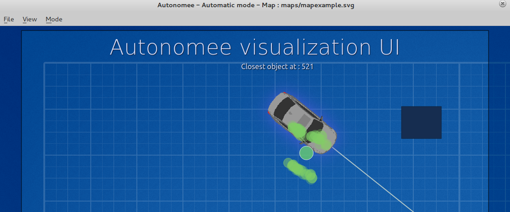
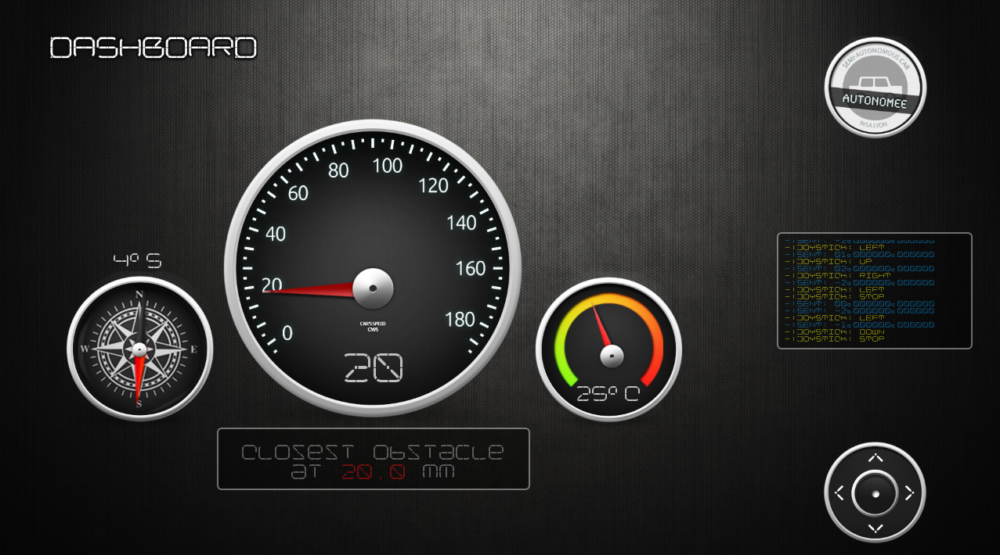
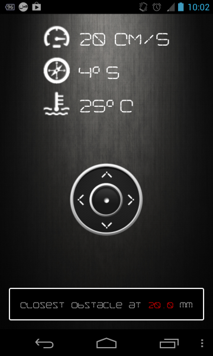

# autonomee

A client/server for robot localization (using a 'particle filter') and distant control.

You can also check the robot's arduino sketch, __arduino.ino__. 

## Features

* A basic SVG parser
* A pathfinder (A\*)
* Nearest obstacle detection (to simulate the sensor's measurements)
* Basic probability model : particle filter. (hopefully we'll also implement one based on Kalman's filter)
* Visualization of the robot's movements and the particles used to localize it.
* A client/server to push commands to the car and control it (through serial ports)

## Dependencies

* Python 2.7
* Qt and PySide (Qt's python binding)
* Numpy
* PySerial
* Scipy

## Communication protocol

The packets sent to the server (TCP) respect this format:

OPCODE(2 chars) + "#" + OPERANDE 1 (6 chars) + "#" + OPERANDE 2 (6 chars)

### Supported operations

* Running forward: 01
01#000000#000000
* Running backward: 01
-01#000000#000000
* Turning right : 02
02#000000#000000
* Turning left :
-2#000000#000000
* Setting speed : 05, first operand is a factor ranging from 0 to 250.
05#000180#000000

## Mobile app

A (responsive) mobile (Android) client compatible with the communication protocol used has been developped by Alexis Fasquel.

## Updates :

### 2 May 2013

The project's name has changed from 'Carosif' to 'Autonomee'.

### 28 April 2013

We've added many major features, including a dashboard showing the sensors' data, a dialog to configure the car's properties and the visualization of the particle filter.

Here's a video showing the particle filter in action :

http://www.youtube.com/watch?v=Mcl2Vz46rro

### 25 March 2013

This now also includes a server/client made to be used in a Raspberry Pi connected to the Arduino controlling the car. Check how that work out in a 'joystick controlled' mode :

https://www.youtube.com/watch?v=rbX47X8HtGU
